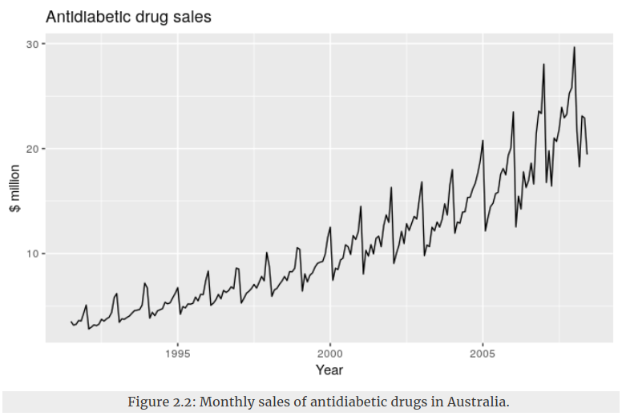
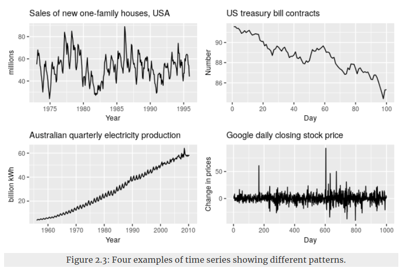
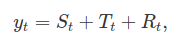
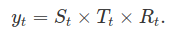
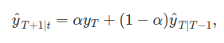
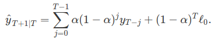
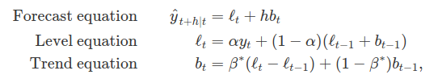
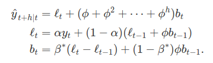
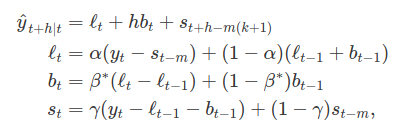

Forecasting
==================

# 1. Time series decomposition
* Dữ liệu time series có thể là sự tổng hợp của nhiều pattern khác nhau. Vì vậy, việc phân tích (phân rã) data thành các thành phần là hữu ích:
	* Hiểu bản chất dữ liệu
	* Sử dụng thuật toán dự báo phù hợp, có khả năng capture được pattern của data
* Các kiểu pattern chính của dữ liệu time series
	* Trend: xuất hiện khi có sự tăng (hoặc giảm) dài hạn trong data.
		* Ví dụ minh họa trend
		 
	* Seasonality: xảy ra khi dữ liệu chịu ảnh hưởng bởi những nhân tố mang tính thời kì (mùa vụ) như theo ngày trong tuần, theo tháng, theo năm. Tính mùa vụ này luôn cố định và biết trước tần suất. Ví dụ trong ví dụ của phần trend, tính mùa vụ được nhận thấy là có chu kì lặp lại theo năm (đầu năm giá thấp, sau đó giá tăng dần và đến sát cuối năm thì tụt mạnh)
	* Cycles: xảy ra khi dữ liệu biến động không theo 1 tần suất biết trước. Hiện tượng này chịu ảnh hưởng bởi các nhân tố kinh tế, môi trường,...
	> **Phân biệt Seasonal và Cycles**: Nếu sự biến động không biết trước tần suất thì là cycles. Nếu sự biến động có tần suất cố định và gắn liền với khía cạnh của lịch (ngày, tháng, năm) thì là seasonal.
	* Ví dụ minh họa các kiểu pattern
	 
		* Hình top-left
			* Seasonal theo năm
			* Cycles theo khoảng 6-10 năm
			* Không có trend
		* Hình top-right
			* Trend giảm
		* Hình bottom-left
			* Trend tăng
			* Có Seasonal
		* Hình bottom-right
			* Không có trend, seasonal, cycles
			* Sự biến động của data rất khó nắm bắt được pattern. Vì thế khó dự đoán

* Dữ liệu time series thường phân rã thành 3 phần
	* Trend: gồm trend và cycles
	* Seasonal
	* Phần dư còn lại

* Có 2 hướng phân rã dữ liệu
	* Additive decomposition
	 
	* Multiplicative decomposition
	
	trong đó, yt là dữ liệu, St là seasonal, Tt là trend, Rt là phần dư còn lại
	* Additive decomposition phù hợp khi độ lớn của sự biến động của seasonal (hoặc của trend-cycle) không thay đổi theo mức độ (level) của dữ liệu. Nghĩa là nếu y ở khoảng giá trị bé hay khoảng lớn thì mức độ thay đổi của trend-cycle, seasonal là tương tự nhau thì additive là phù hợp. Ngược lại thì nên dùng multiplicative

# 2. Exponential Smoothing
> Ý tưởng: Thuật toán dự đoán giá trị dữ liệu ở thời điểm t+1 dựa trên giá trị các giá trị của t thời điểm trước. Các điểm dữ liệu gần đây sẽ có trọng số cao hơn đóng góp vào dự báo, trọng số của các điểm dữ liệu xa trong quá khứ sẽ có *trọng số giảm theo hàm mũ*

## 2.1. Simple exponential smoothing
* Phù hợp với dữ liệu không có trend và seasonal rõ ràng. Bởi vì thuật toán dự báo dựa trên tổ hợp có trọng số giữa các điểm dữ liệu quá khứ nên khó có thể nắm bắt được trend
* Biểu thức
	

	sau khi expand thu được
	
	
	* Hệ số alpha sẽ điều khiển trade-off giữa mức độ quan trọng của các dữ liệu gần hiện tại và tốc độ giảm hàm mũ của các trọng số ứng với các điểm dữ liệu xa trong quá khứ

## 2.2. Trend methods
### 2.2.1. Holt's linear trend method
* Cho phép dự đoán với dữ liệu có trend
* Biểu thức
	
	
	* Tại mỗi thời điểm, giá trị dự đoán được tính theo ước lượng level (ước lượng thô của giá trị hiện tại) và trend. Sở dĩ phương pháp này capture được trend bởi vì nó có phần ước lượng trend. 
	* Ước lượng level ở thời điểm t (lt) dựa vào yt (thực tế) và ước lượng yt ở thời điểm t-1 ( l(t-1) + b(t-1) )
	* Ước lượng trend ở thời điểm t (bt) dựa vào mức thay đổi giữa level tại thời điểm t, t-1; và trend tại t-1

### 2.2.2. Damped trend methods
* Tương tự Holt's linear trend method, nhưng giải quyết được 1 nhược điểm của Holt linear là khi dự báo cho khoảng thời gian tương lai *dài* thì hệ số trend là constant, nghĩa là nó dễ dự báo sai. Phương pháp này sẽ thêm 1 hệ số mới giúp làm giảm trend khi dự báo cho tương lai dài
* Biểu thức
	
	
	tham số phi điều khiển mức độ giảm trend khi dự báo tương lai xa. Nếu phi = 1 thì phương pháp này trở thành Holt's linear trend method

## 2.3. Holt-Winters’ seasonal method
* Phương pháp này capture được seasonal pattern nhờ đưa thêm thành phần seasonal vào biểu thức
* Biểu thức (additive)
	
	
	trong đó, k là phần nguyên của (h-1)/m. m là độ dài của season (ví dụ dữ liệu lặp lại theo hằng tuần và dữ liệu là có theo từng giờ thì m=7*24=168)

# 3. ARIMA models
## 3.1. Stationarity và Differencing
### 3.1.1. Stationarity
* Định nghĩa: Time series gọi là stationary nếu các thuộc tính thống kê (mean, variance) của nó không thay đổi theo thời gian. Nói cách khác nếu ta quan sát dữ liệu trong một khoảng nào đó thì ta không biết được các điểm dữ liệu đó được lấy từ thời gian nào
### 3.1.2. Differencing

# References
* [Forecasting: Principles and Practice](https://otexts.org/fpp2/index.html) 