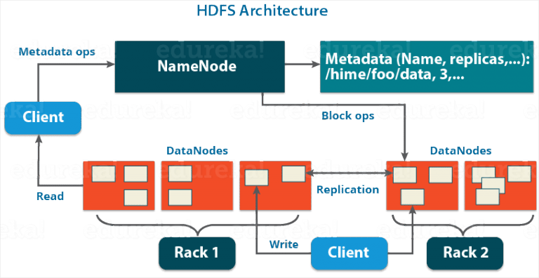

Hadoop Distributed File System (HDFS)
=========================

## Giới thiệu

* Khái niệm
	* Distributed File System (DFS) là hệ thống quản lý, lưu trữ file phân tán (file được chia thành nhiều phần dữ liệu, lưu trữ trên nhiều máy tính), cho phép nhiều người cùng truy cập dữ liệu.
	* HDFS là hệ thống viết bằng Java dùng để quản lý file phân tán trong cụm Hadoop.
	
* Lý do ra đời bắt nguồn từ thách thức trong việc xử lý, lưu trữ **dữ liệu lớn**
	* Lưu trữ: lưu trữ truyền thống trên 1 máy tính gặp giới hạn kích thước bộ nhớ (không thể lưu toàn bộ lượng dữ liệu lớn). Khi đó cần sử dụng **nhiều máy tính** có tổng lượng bộ nhớ lớn hơn
	* Xử lý: dùng nhiều máy tính sẽ tạo ra năng lực tính toán tốt hơn (dùng cơ chế tính toán song song)
	* Mở rộng: việc mở rộng bằng cách nâng cấp ram/cpu cho 1 máy tính chỉ thực hiện được ở 1 mức độ nhất định và khi đó, hệ thống sẽ phải dừng hoạt động để nâng cấp. Khi nâng cấp trong hệ phân tán thì chỉ cần thêm máy vào cụm mà không phải dừng hệ thống

## Đặc điểm
* Khả năng mở rộng tốt
* Chịu lỗi
* Toàn vẹn dữ liệu
* Lưu trữ lượng lớn và đa dạng dữ liệu
* Giảm thời gian xử lý dữ liệu	

## Kiến trúc
* HDFS sử dụng kiến trúc NameNode - DataNode (Master - Slave). Thường có 1 NameNode và nhiều DataNode. NameNode chạy trên 1 máy, lưu thông tin quản lý các DataNode. Mỗi DataNode thường cài đặt trên 1 máy, chứa dữ liệu thực sự. 

* NameNode: lưu thông tin mô tả dữ liệu của HDFS (meta data), ví dụ như: danh sách các block của các file, ip máy lưu các block, quyền truy cập file,... NameNode sử dụng 2 file để quản lý:
	* FsImage (File System Image): lưu toàn bộ trạng thái của HDFS (nêu trên)
	* EditLog: lưu các sự thay đổi của hệ thống file, ví dụ: khi tạo file mới, thay đổi hệ số bản sao dữ liệu,...
	
NameNode theo định kì sẽ nhận Heartbeat (một loại tin nhắn) từ các DataNode để kiểm tra các DataNode còn sống không. Nếu DataNode nào quá hạn mà không gửi tin nhắn thì NameNode coi nó đã chết và sẽ tạo các bản sao mới để duy trì được hệ số copy. Ngoài ra các DataNode còn gửi BlockReport (danh sách các block mà DataNode đó lưu trữ) cho NameNode.

NameNode thực hiện 1 số chức năng: tạo mới, xóa file,...

* DataNode: lưu trữ dữ liệu, thực hiện thao tác đọc - ghi dữ liệu. Định kì gửi Heartbeat, BlockReport tới NameNode để báo cáo.

* Data blocks: Các file dữ liệu thường được chia nhỏ thành các block có kích thước quy định trước (trừ block cuối có thể có kích thước nhỏ hơn)

* Cơ chế tạo bản copy dữ liệu (Replicate)
	* Vấn đề: Nếu tạo nhiều bản copy dữ liệu trên các máy cùng 1 rack thì nếu rack đó bị hỏng thì dữ liệu thực sự bị mất (*bỏ trứng cùng 1 giỏ*). Nếu các bản copy dữ liệu được phân tán ở các rack khác nhau thì sẽ tăng thời gian cho thao tác ghi file...

* Quy trình đọc ghi dữ liệu

* Sử dụng nhiều NameNode
* Cân bằng tải

## References
* [Edureka - Apache Hadoop HDFS Architecture](https://www.edureka.co/blog/apache-hadoop-hdfs-architecture/)
* [DataFlair - Apache Hadoop HDFS Architecture](https://data-flair.training/blogs/hadoop-hdfs-architecture/)
* [HDFS Document](https://hadoop.apache.org/docs/stable/hadoop-project-dist/hadoop-hdfs/HdfsDesign.html)