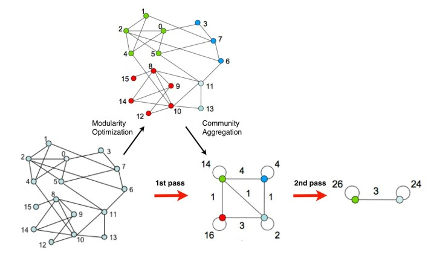

Louvain - Community detection algorithm
==================

# 1. Giới thiệu
* Đây là thuật toán non-overlapping community detection
* Độ phức tạp: O(m) với m là số cạnh
* Ưu điểm
	* Dễ hiểu, dễ cài đặt
	* Thời gian thực hiện: nhanh, giới hạn về kích cỡ mạng có thể xử lý chủ yếu là bởi giới hạn về bộ nhớ của máy chứ không còn bị giới hạn bởi thời gian thực hiện thuật toán
	* Áp dụng được với mạng có trọng số trên các cạnh
	* Cho phép tìm ra các cộng đồng ở các mức độ *phân giải* khác nhau (nghĩa là có thể phát hiện cộng đồng từ mức vĩ mô, ít cộng đồng nhưng cộng đồng lớn, cho đến mức vi mô có nhiều cộng đồng nhỏ)
	* Chất lượng các cộng đồng phát hiện được là tốt (nếu đánh giá theo tối ưu hóa modularity), nhưng đánh giá theo paper 2018 thì chất lượng chưa tốt !

* Thuật toán tìm cách phân mỗi đỉnh vào 1 cộng đồng mà tối ưu hóa modularity (modularity là giá trị thuộc đoạn [-1,1])
	* Biểu thức dùng trong paper
	
	
	* Biểu thức tổng quát (có thêm tham số gamma), nếu gamma = 1 thì giống biểu thức bên trên (phân tích kĩ sẽ thấy tương đương)
	

* Ý nghĩa của việc dùng biểu thức tối ưu hóa modularity
	* Modularity được dùng làm tiêu chí đánh giá chất lượng cộng đồng thu được bởi các thuật toán để chọn ra thuật toán tốt hơn. Đồng thời modularity cũng được chọn là hàm mục tiêu cần tối ưu trong 1 số thuật toán
	* Thuật toán Louvain sẽ tìm cách phân chia cộng đồng mà **xấp xỉ được lời giải tối ưu hóa modularity** (do việc tìm lời giải chính xác là bài toán NP khó)
	* Nếu dùng tiêu chí đánh giá chất lượng thuật toán là: các cộng đồng thu được có tối thiểu số cạnh kết nối giữa các cộng đồng, thì sẽ dẫn tới cách phân cộng đồng là 1 đỉnh thuộc 1 cộng đồng và các đỉnh khác thuộc cộng đồng còn lại. Tiêu chí này phù hợp với bài toán min-cut, nhưng không phù hợp với bài toán phát hiện cộng đồng do kết quả thu được không có ý nghĩa
	* Newman mới đề xuất biểu thức modularity như 1 tiêu chí phù hợp hơn. **Ý nghĩa là**
	> Một tập các đỉnh được coi là có đặc trưng của 1 cộng đồng nếu *số lượng cạnh kết nối* trong tập đỉnh này nhiều hơn *số lượng cạnh kì vọng* khi các cạnh được kết nối ngẫu nhiên và có cùng phân bố bậc của các đỉnh. Modularity đo lường lượng chênh lệch giữa 2 đại lượng trên.
	* Trong biểu thức modularity tổng quát
		* e là số cạnh trong cộng đồng C
		* Kc là tổng số bậc của các đỉnh trong C
		* m là số cạnh của đồ thị
		* (Kc^2 / 2m) là số cạnh kì vọng được tính theo cách sau
			* Chọn 1 cạnh bất kì có 1 đỉnh là 1 đỉnh thuộc C. Tính xác suất p để đỉnh còn lại thuộc C. Khi đó p = Kc / 2m (2m là tổng số bậc của đồ thị)
			* Số cạnh kì vọng là Kc * p

* Thuật toán thực hiện lặp lại 2 pha cho đến khi hội tụ (không có bất cứ local move nào ở pha 1 có thể thực hiện)
	* Ban đầu khởi tạo mỗi đỉnh của đồ thị thuộc 1 cộng đồng
	* Pha 1: Thực hiện các local moves để thu được local maximum modularity
		* Với mỗi node i, xét mọi hàng xóm j kề với i, tìm đỉnh j mà nếu chuyển cộng đồng của i sang thành cùng cộng đồng với đỉnh j mà tăng được Q lớn nhất thì thực hiện chuyển đỉnh i sang cùng cộng đồng của đỉnh j (nếu không có hàng xóm j nào làm cho Q tăng thì giữ nguyên cộng đồng của đỉnh i). Lặp lại (mỗi đỉnh có khi được xét nhiều lần) cho đến khi nào ko tìm được local move làm tăng Q thì kết thúc pha 1
		* Khi xét đỉnh i và hàng xóm j thì để tính độ tăng/giảm modularity một cách nhanh chóng, ta sử dụng phương pháp tính toán gia tăng. Ta tách quá trình chuyển đỉnh i từ cộng đồng cũ của nó sang cộng đồng của đỉnh j thành 2 giai đoạn
			* Tách đỉnh i khỏi cộng đồng cũ (công thức tính deltaQ tương tự bên dưới)
			* Đưa đỉnh i vào cộng đồng của đỉnh j. Công thức tính deltaQ (modularity gain) như sau
			
	* Pha 2: Xây dựng đồ thị mới (hợp nhất các đỉnh thuộc cùng 1 cộng đồng)
		* Mỗi đỉnh là 1 cộng đồng tìm được ở pha 1 ngay trước đó
		* Mỗi cạnh kết nối 2 đỉnh nếu 2 cộng đồng tương ứng có
		* Trọng số của cạnh bằng tổng trọng số các cạnh kết nối giữa 2 cộng đồng tương ứng trong pha 1

* Trực quan hóa 2 pha thực hiện của thuật toán
    

* Nhận xét
	* Ở những pha 1 của các lần lặp sau, thuật toán phát hiện cộng đồng của các cộng đồng (mỗi đỉnh của lần lặp sau là một cộng đồng của lần lặp trước)
	* Thứ tự xét các đỉnh trong pha 1 ảnh hưởng đến kết quả cộng đồng được tạo ra. Nhưng thực nghiệm trên 1 số dataset thì kết quả có thể khác nhau nhưng giá trị modularity thì không khác nhau đáng kể
	* Tốc độ thực hiện thuật toán có thể được cải thiện nhờ áp dụng 1 số cách sau
		* Trong pha 1, không xét toàn bộ hàng xóm mà có thể chọn ngẫu nhiên
		* Dừng thuật toán khi lượng Q tăng của pha 1 đạt dưới 1 ngưỡng cho trước
		* Nghiên cứu thêm cách chọn thứ tự đỉnh trong pha 1

# References
* [Fast unfolding of communities in large networks](https://arxiv.org/abs/0803.0476)
* [CS224W - Lecture 06 - Community Structure in Networks](http://web.stanford.edu/class/cs224w/handouts/06-communities.pdf)