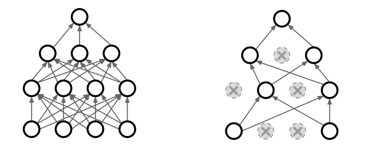

# 1. Batch Normalization
* Khái niệm Internal Covariate Shift: phân bố input của mỗi layer trong mạng NN bị thay đổi

* Vấn đề khi training mạng NN sâu (nhiều layer)
	* Xét theo trực quan thì quá trình học sẽ khó (lâu)
		* Trọng số của layer l (phía sau) được cập nhật theo hướng tạo ra hàm ánh xạ f map giữa input của layer l với true output. Vòng lặp sau, với mini-batch khác thì phân bố của input layer l bị thay đổi khiến trọng số layer l lại phải cập nhật để thích ứng theo sự thay đổi phân bố của input. Nói cách khác, input biến thiên quá nhiều khiến quá trình training lâu hội tụ hơn
	* Phân bố của output của một layer bị ảnh hưởng bởi rất nhiều trọng số của rất nhiều layer phía trước

* Giải thích trực quan
	* Giải thích bằng phép ẩn dụ, so sánh với ví dụ xảy ra trong một công ty !
		* Tưởng tượng, một công ty có mô hình quản lý nhân viên phân cấp (sếp tổng, bên dưới có các giảm đốc, bên dưới có các trưởng phòng, nhân viên)
		* Các nhân viên cấp dưới phải báo cáo tiến độ, công việc cho người quản lý trực tiếp phía trên. Tương tự, sếp tổng sẽ nhận được báo cáo của các giám đốc
		* Sếp tổng đọc báo cáo, thấy có lỗi (hàm loss tính theo yhat và y), truyền chỉ đạo hướng hành động (backpropagate) xuống cho các giám đốc. Chú ý rằng, hành động được đưa ra dựa trên bản báo cáo mới đây của các giám đốc. Vấn đề là bản báo cáo của các giám đốc là khá xa rời so với bản báo cáo đúng (phân bố của output của giám đốc chịu ảnh hưởng bởi rất nhiều báo cáo của các cấp dưới)
		* Quá trình chỉ đạo được lan xuống đến nhân viên thấp nhất. Sau đó các nhân viên lại báo cáo lên trên. Mỗi cấp trên sẽ *bất ngờ* khi bản báo cáo của cấp dưới mỗi lúc một format khác nhau. Việc format của bản báo cáo thay đổi quá nhiều khiến cấp trên không thích ứng kịp, dẫn đến hiểu sai sự việc, và chính bản thân lại xuất ra 1 bản báo cáo có format khác với format trước đây của mình và nộp báo cáo lên cấp trên
		* Nhưng khi dùng Batch Normalization thì format của mỗi bản báo cáo được điều khiển bởi 2 tham số (không còn chịu nhiều ảnh hưởng bởi các báo cáo của các cấp dưới). Điều này khiến cấp trên dễ thích ứng với sự thay đổi của bản báo cáo của cấp dưới. Đồng thời nhờ 2 tham số này mà có thể linh động, mềm dẻo thay đổi format báo cáo để tạo ra 1 hệ thống cho output tốt nhất

* Lợi ích của Batch Normalization
	* Theo paper gốc của BN thì tác giả cho rằng BN mang lại hiệu quả tốt bởi nó đã loại bỏ đi hiện tượng Internal Covariate Shift (ICS) nhưng theo kết quả mới đây [2] (06/2018) thì quan điểm trên là **sai**. Trong 1 số TH, khi dùng BN thì hiện tượng ICS còn gia tăng, điều này hoàn toàn có thể bởi vì khi dùng BN, ta có 2 tham số gamma, beta có thể làm phân bố của input thay đổi (chứ ko phải cố định bởi phân bố chuẩn mean = 0, variance = 1)
	* BN mang lại hiệu quả bởi vì nó làm loss mượt hơn
	* Nhìn theo khía cạnh khác, BN có thể coi như một phương pháp Regularization. Với mỗi sample data, khi nó nằm trong các batch khác nhau thì sau khi normalize sẽ thu được tọa độ khác nhau (theo công thức tọa độ mới chịu ảnh hưởng bởi mean, variance của batch đó, mang tính ngẫu nhiên). Điều này giống như ta thêm chút nhiễu vào trong mạng NN.

* Công thức của Batch Normalization
	
	

* Sử dụng Batch Normalization ở vị trí nào trong mạng NN
	* Theo Andrew Ng (Cousera) và khóa CS231n thì cho rằng nên để BN layer sau Fully connected và ngay trước non-linear activation
	* Theo bài blog [1] thì tác giả nói rằng có nhiều kết quả cho thấy đặt BN layer sau activation thì cho kết quả tốt hơn

* Phân tích công thức Batch Normalization
	* Giai đoạn training
		* Gọi x là mini-batch (output của affine layer)
		* Tính mean và variance của mini-batch (đây là ước lượng cho mean và variance của toàn tập training khi qua layer này, con số này sẽ khác nhau theo các batch khác nhau)
		* Normalize x theo mean và variance vừa tính
		* Scale và shift. Hai tham số gamma và beta được mạng học để tìm ra phân bố phù hợp nhất (nếu *cứng nhắc* đưa x về phân bố normal với mean = 0, var = 1 thì sẽ làm giảm rất nhiều khả năng của mạng, thay vào đó ta hãy để mạng tự học một phân bố phù hợp)
		* Như vậy, dù các trọng số của các layer phía trước có thay đổi nhiều thì phân bố input của các layer phía sau chủ yếu chịu ảnh hưởng của 2 tham số gamma, beta
	* Giai đoạn test
		* Vấn đề là cần tính mean và variance của batch, trong khi lúc test ta thường chỉ có 1 sample
		* Ta sẽ sử dụng mean và var tính từ tập training. Ước lượng 2 giá trị này bằng running average của các mini-batch mean và var có được lúc training (trong lúc training, mỗi khi fed 1 batch vào ta tính được mean, var của batch đó, ta lưu giá trị này vào running average). Như vậy sau khi kết thúc training, ta thu được mean, var (trung bình có trọng số của các batch mean, var với trọng số giảm theo hàm mũ, các mean, var gặp càng xa trong quá khứ sẽ có trọng số nhỏ hơn) là một ước lượng cho mean và var của toàn tập training
		* Các ước lượng mean, var của toàn tập training bằng cách tính running average được implement trong nhiều framework deeplearning

# 2. Dropout

* Dropout là một phương pháp Regularization, giúp hạn chế overfitting trong mạng NN

* Dropout làm gì?
	* Trong lúc training, ngẫu nhiên loại bỏ các neuron với một xác suất được xác định trước (hyper parameter cần phải tuning, thường dùng là 0.5)
	
	
	
	* Khi test thì phải đảm bảo giá trị kì vòng của output của mỗi neuron phải *xấp xỉ bằng* giá trị kì vọng tương ứng trong lúc training. Sở dĩ phải đảm bảo bởi vì, khi drop các neuron layer l trong training thì giá trị kì vọng của output của layer l+1 sẽ bị giảm (tương ứng với nhân thêm xác suất giữ các neuron (E -> E*p với p là xác suất giữ các neuron))
	* Để đảm bảo kì vọng không đổi, ta có 2 cách implement dropout, trong đó inverted dropout phổ biến trong thực tế, được implement trong Tensorflow, Keras do giảm thời gian test hơn so với dropout phiên bản gốc
		* Dropout phiên bản gốc
			* Training: Chỉ thực hiện mask để drop các neuron
			* Test: Nhân mỗi output của mỗi activation thêm một xác suất p (p là xác suất giữ các neuron)
		* Inveted Dropout
			* Training: Thực hiện mask để drop các neuron, sau đó nhân (khuếch đại lên) output của mỗi activation bởi 1/p
			* Test: Giữ nguyên mạng NN (không mất thời gian cho việc nhân output activation với p)

* Giải thích lợi ích của việc dùng Dropout theo nhiều khía cạnh
	* Giảm tính co-apdaptation của các neuron
		* Điều này khiến mỗi neuron trọng mạng đều phải học được một thông tin nhất định. Tránh việc sử dụng một mô hình lớn (nhiều neuron, nhiều tham số) nhưng rất nhiều neuron lại vô ích, điều này gây lãng phí thời gian training. Nếu thật sự chỉ cần mạng nhỏ để fit data thì ta chỉ cần dùng model nhỏ, chứ không nên dùng một mô hình lớn và để mặc cho việc rất nhiều neuron vô ích tồn tại
		* Giải thích bằng hình ảnh trong một công ty (Tưởng tượng mô hình quản lý phân cấp như ví dụ trong Batch Normalization)
			* Vấn đề là tồn tại *dây chuyền bè cánh, phe phái* và những nhân viên không làm việc
			* Khi sếp tổng truyền chỉ đạo thực hiện công việc cho giám đốc và mong muốn mọi nhân viên dưới quyền giám đốc sẽ cùng nhau thực hiện công việc. Thực tế là giám đốc này đã quen *ăn chia, bè phái* với trưởng phòng A, B, còn trưởng phòng C, D thì không thuộc *dây chuyền* này
			* Khi đó, mọi chỉ đạo chỉ được truyền xuống cho C, D, còn A, B chằng làm việc (do có ông sếp trên nâng đỡ). Như vậy, mọi công việc báo cáo lên trên và chỉ đạo truyền xuống dưới chỉ được truyền qua giám đốc và C,D. Kết nối giữa giám đốc và A,B không mang lại lợi ích cho công ty
			* Khi áp dụng Dropout vào mô hình công ty này ta sẽ bắt mọi nhân viên đều phải làm việc!
			* Mỗi ngày đi làm, ngẫu nhiên cho một số nhân viên nghỉ việc. Một ngày đẹp trời, C và D nghỉ việc. Khi đó người giám đốc buộc phải bắt A, B làm việc (nếu không thì sếp tổng trách mắng). Tương tự, vào một ngày khác, người bị tạm nghỉ là giám đốc. Khi đó chỉ đạo từ trên sẽ được truyền từ giám đốc khác (cùng layer với ông giám đốc kia) xuống cho A,B,C,D và mọi trưởng phòng đều phải làm việc (do không tồn tại dây chuyền cũ)
			* Như vậy ta đã tránh được việc tồn tại nhân viên không làm việc (lúc chưa dùng dropout thì giám đốc chỉ có 2 trưởng phòng làm việc, không tận dụng được hết nhân lực, và nếu C,D mà hoạt động kém thì hậu quả càng tệ hại hơn, nếu mà có thêm các trưởng phòng A,B đều làm việc thì lúc người này làm kém thì đã có thêm người khác bù lại) 
			
	* Hạn chế việc học *quá nhiều* của mỗi tham số
		* Khi drop một neuron trong 1 lần forward-backward thì các tham số gắn liên với neuron này là *vắng mặt* trong lượt train này. Do đó nó sẽ không học được thông tin từ batch data đó. Việc này nhằm hạn chế overfitting
	* Dropout lúc test chính là **ensemble model**
		* Mỗi vòng lặp training 1 batch, ta đã sử dụng 1 mô hình mạng khác nhau (do drop khiến mạng thu được rất đa dạng) và lúc test ta dùng model xấp xỉ kì vọng của các model lúc train. Ensemble sẽ giúp mạng có khả năng khái quát hóa tốt hơn trong tương lai, hạn chế được overfitting.

# References
* [Intro to optimization in deep learning: Busting the myth about batch normalization](https://blog.paperspace.com/busting-the-myths-about-batch-normalization/)
* [How Does Batch Normalization Help Optimization? (No, It Is Not About Internal Covariate Shift)](https://arxiv.org/pdf/1805.11604.pdf) 