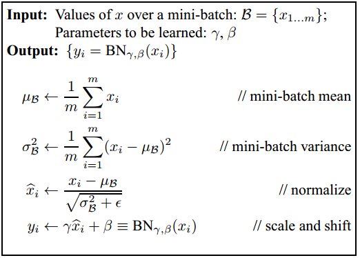

# 1. Batch Normalization
* Khái niệm Internal Covariate Shift: phân bố input của mỗi layer trong mạng NN bị thay đổi

* Vấn đề khi training mạng NN sâu (nhiều layer)
	* Xét theo trực quan thì quá trình học sẽ khó (lâu)
		* Giải thích bằng phép ẩn dụ, so sánh với ví dụ xảy ra trong một công ty !
			* ...
		* Trọng số của layer l (phía sau) được cập nhật theo hướng tạo ra hàm ánh xạ f map giữa input của layer l với true output. Vòng lặp sau, với mini-batch khác thì phân bố của input layer l bị thay đổi khiến trọng số layer l lại phải cập nhật để thích ứng theo sự thay đổi phân bố của input. Nói cách khác, input biến thiên quá nhiều khiến quá trình training lâu hội tụ hơn
	* Phân bố của output của một layer bị ảnh hưởng bởi rất nhiều trọng số của rất nhiều layer phía trước

* Lợi ích của Batch Normalization
	* Theo paper gốc của BN thì tác giả cho rằng BN mang lại hiệu quả tốt bởi nó đã loại bỏ đi hiện tượng Internal Covariate Shift (ICS) nhưng theo kết quả mới đây (06/2018) thì quan điểm trên là **sai**. Trong 1 số TH, khi dùng BN thì hiện tượng ICS còn gia tăng, điều này hoàn toàn có thể bởi vì khi dùng BN, ta có 2 tham số gamma, beta có thể làm phân bố của input thay đổi (chứ ko phải cố định bởi phân bố chuẩn mean = 0, variance = 1)
	* BN mang lại hiệu quả bởi vì nó làm loss mượt hơn
	* Nhìn theo khía cạnh khác, BN có thể coi như một phương pháp Regularization. Với mỗi sample data, khi nó nằm trong các batch khác nhau thì sau khi normalize sẽ thu được tọa độ khác nhau (theo công thức tọa độ mới chịu ảnh hưởng bởi mean, variance của batch đó, mang tính ngẫu nhiên). Điều này giống như ta thêm chút nhiễu vào trong mạng NN.

* Công thức của Batch Normalization
	

* Sử dụng Batch Normalization ở vị trí nào trong mạng NN
	* Theo Andrew Ng (Cousera) và khóa CS231n thì cho rằng nên để BN layer sau Fully connected và ngay trước non-linear activation
	* Theo bài blog [1] thì tác giả nói rằng có nhiều kết quả cho thấy đặt BN layer sau activation thì cho kết quả tốt hơn

* Phân tích công thức Batch Normalization
	* Giai đoạn training
	* Giai đoạn test
	

# 2. Dropout

# References
* [Intro to optimization in deep learning: Busting the myth about batch normalization](https://blog.paperspace.com/busting-the-myths-about-batch-normalization/)
* [How Does Batch Normalization Help Optimization? (No, It Is Not About Internal Covariate Shift)](https://arxiv.org/pdf/1805.11604.pdf) 