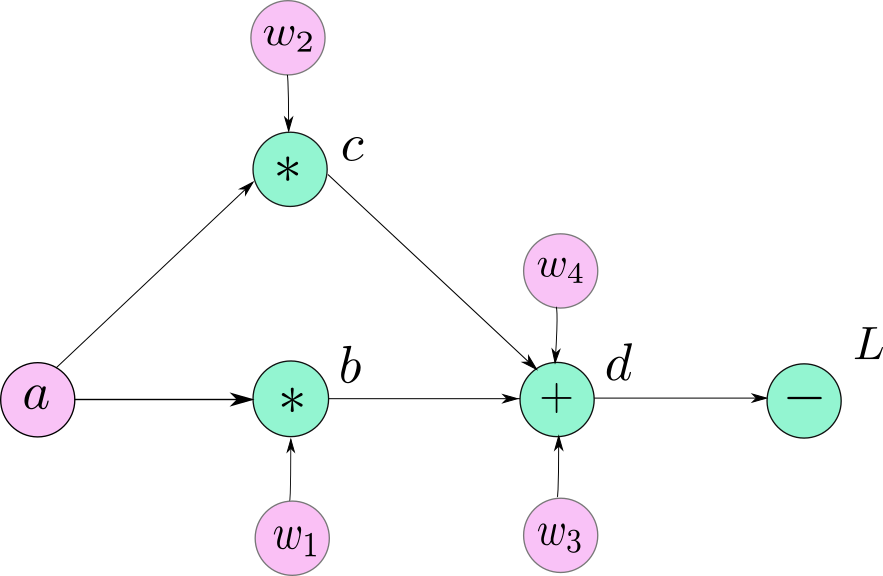
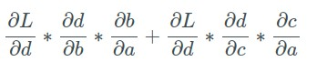

PyTorch
===================

# Đồ thị tính toán và cách PyTorch tính toán đạo hàm

* PyTorch là thư viện Deep Learning. Do đó cần có cơ chế tự động tính lan truyền tiến và ngược mà không phụ thuộc vào kiến trúc mạng mà người lập trình xây dựng.
* PyTorch dùng khái niệm đồ thị tính toán (Computation graph) để thực hiện công việc tính đạo hàm.

* Khi user định nghĩa kiến trúc mạng, tức là định nghĩa quan hệ tính toán giữa các tensor thì PyTorch xây dựng đồ thị tính toán.

* Để tính đạo hàm (VD dL/da) thì dùng quy tắc đạo hàm chuỗi (chain rule) như sau

* Giải thích công thức
	* Để tính giá trị L thì có 2 con đường mà giá trị a đóng góp đó là a -> c -> d -> L và a -> b -> d -> L
	* Mỗi đường đi sẽ tính đạo hàm bằng quy tắc chuỗi (nhân các giá trị đạo hàm local dọc theo đường đi đó)
	* Cuối cùng + các giá trị đạo hàm của các đường đi khác nhau lại

* Về thư viện Pytorch
	* Mỗi tensor (L, d, a,...) đều có thuộc tính ``grad_fn`` là toán tử sinh ra giá trị tensor này (VD ``d.grad_fn == AddBackward``, tức là toán tử +) và có thuộc tính ``grad`` chứa giá trị đạo hàm của 1 biến nào đó theo biến tensor này.
	* Mỗi toán tử (hàm) có kiểu kế thừa từ ``nn.autograd.function``. Đều phải implement 2 hàm là forward và backward. Ví dụ khi cài đặt custom function được trình bày ở phần sau.
	* Khi cần tính đạo hàm của L theo các biến thì gọi hàm ``L.backward()``. PyTorch sẽ lan truyền việc tính đạo hàm một cách đệ quy như sau
		* Xét thời điểm hiện tại, đã có đạo hàm L theo biến b = f(a,w1) (giống hình). Cần tính đạo hàm dL/da, dL/dw1. Từ b, tìm được hàm f tạo ra b bởi thuộc tính ``grad_fn``. Tính đạo hàm df/da, df/dw1 (được cài đặt trong hàm backward của function), hàm backward sẽ return 2 giá trị dL/da, dL/dw1 bằng chain rule, các giá trị cần thiết để tính đạo hàm được lưu trong context khi gọi hàm forward.
		* Tiếp tục đệ quy đối với các hàm sinh ra giá trị a, w1.

* Phân biệt 1 số khái niệm
	* ``requires_grad``: thuộc tính Boolean của tensor. Khi giá trị này là False thì giá trị ``grad_fn`` của tensor đó là None. Thiết lập giá trị False khi không muốn tính đạo hàm theo tensor này. Khi mọi input tensor đều có ``requires_grad=False`` thì tensor output sẽ có ``requires_grad=False``. Chỉ có leaf tensor mới có thể thay đổi giá trị này (c = a + b thì c không phải leaf tensor).
	* ``detach``: là hàm của tensor. Gọi hàm này sẽ tạo ra tensor mới có chung vùng nhớ với tensor gốc, nhưng tensor mới có ``requires_grad=False``. Khi không muốn đạo hàm lan truyền về các tensor trước (đạo hàm sẽ lan truyền đến tensor hiện tại và dừng) thì dùng detach.
	* ``no_grad``: sử dụng trong ``with torch.no_grad():``. Các tensor tạo ra trong đoạn code đó sẽ có ``requires_grad=False``. Hàm này có thể dùng trong quá trình eval.
	* ``clone``: tạo ra tensor mới với vùng nhớ khác, nhưng có giá trị thuộc tính ``requires_grad`` giống tensor gốc, và các kết nối trong computation graph giống tensor gốc. Điều này cho phép tính toán đạo hàm của 2 tensor này giống nhau.

# Các thành phần chính

* Tensor: mảng nhiều chiều lưu trữ dữ liệu

* Function: hàm chuyển đổi input thành output, **không lưu các giá trị như trọng số**

* Module: thực hiện chuyển đổi input thành output, hay dùng để biểu diễn layer trong mạng neuron. Điểm khác biệt so với Function là trong module sẽ **lưu các giá trị trọng số** để cập nhật trong quá trình training
	* Module có thể chứa các module, function khác
	* Để tạo ra custom module thì cần định nghĩa class kế thừa từ class nn.module. Đồng thời override hàm `__init__` và `forward`

* Class ``nn.Sequential``: dùng để ghép nhiều đối tượng module lại theo 1 trình tự tuần tự (xếp chồng các layer theo tuần tự).

* Class ``Dataset``: Để định nghĩa dataset của bài toán thì thường dùng class kế thừa từ ``torch.utils.data.Dataset``. Có thể iterate qua đối tượng dataset để get sample. Cần định nghĩa 3 hàm
	* ``__init__``: lưu các thuộc tính liên quan đến data, có thể lưu các hàm transform, data augmentation.
	* ``__len__``: trả về số sample có trong dataset
	* ``__getitem__``: nhận tham số i là index của phần tử cần lấy trong dataset, trả về phần tử cần lấy

* Class ``Dataloader``: Khởi tạo đối tượng thuộc kiểu ``Dataloader`` và truyền tham số là đối tượng có kiểu ``Dataset``. Dataloader sẽ giúp duyệt qua dataset với 1 số tiện ích: shuffle data sau mỗi epoch, get data theo batch, load nhiều sample nhanh bằng cơ chế sử dụng thread,...

# References

* [PyTorch 101](https://blog.paperspace.com/pytorch-101-understanding-graphs-and-automatic-differentiation/)

* [CS230](https://cs230.stanford.edu/blog/pytorch/)

* [Official PyTorch Tutorial](https://pytorch.org/tutorials/)

* [A comprehensive overview of PyTorch](https://medium.com/@layog/a-comprehensive-overview-of-pytorch-7f70b061963f)

* [PyTorch Autograd](https://towardsdatascience.com/pytorch-autograd-understanding-the-heart-of-pytorchs-magic-2686cd94ec95)

* [Project Template](https://github.com/moemen95/Pytorch-Project-Template)

* 

* Flair, AllenNLP, FairSeq, Torchtext, ...
* [PyTorch tutorial distilled](https://towardsdatascience.com/pytorch-tutorial-distilled-95ce8781a89c)

* [Deep Learning Wizard](https://www.deeplearningwizard.com/deep_learning/intro/)

* [Jhui Blog](https://jhui.github.io/2018/02/09/PyTorch-Basic-operations/)

* [https://github.com/yunjey/pytorch-tutorial](https://github.com/yunjey/pytorch-tutorial)

* [Lecture Stanford CS231n](http://cs231n.stanford.edu/slides/2017/cs231n_2017_lecture8.pdf)

* [JcJohnson PyTorch Example](https://github.com/jcjohnson/pytorch-examples)

* [Pytorch Tutorial Lecture](http://web.cs.ucdavis.edu/~yjlee/teaching/ecs289g-winter2018/Pytorch_Tutorial.pdf)

* [Pytorch Tutorial](https://cise.ufl.edu/~xiaoyong/materials/pytorch_tutorial.pdf)

* [Getting Started with PyTorch Part 1: Understanding how Automatic Differentiation works](https://towardsdatascience.com/getting-started-with-pytorch-part-1-understanding-how-automatic-differentiation-works-5008282073ec)

* [The Incredible PyTorch](https://www.ritchieng.com/the-incredible-pytorch/)

* [FastAI PyTorch Tutorial](https://forums.fast.ai/t/new-pytorch-tutorial-draft-feedback-welcome/22208)

* [A detailed example of how to generate your data in parallel with PyTorch](https://stanford.edu/~shervine/blog/pytorch-how-to-generate-data-parallel)

* [Logging in Tensorboard with PyTorch (or any other library)](https://becominghuman.ai/logging-in-tensorboard-with-pytorch-or-any-other-library-c549163dee9e)

* [How to implement a YOLO (v3) object detector from scratch in PyTorch](https://blog.paperspace.com/how-to-implement-a-yolo-object-detector-in-pytorch/)

* [Awesome-Pytorch-list](https://github.com/bharathgs/Awesome-pytorch-list)