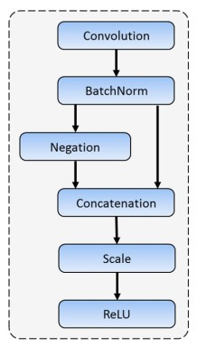
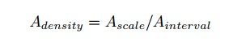
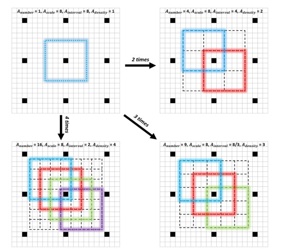

FaceBoxes
===================

# 1. Giới thiệu

* FaceBoxes là thuật toán phát hiện khuôn mặt thời gian thực trên CPU đạt độ chính xác cao
* Paper có 4 sự đóng góp chính
	* Thiết kế Rapidly Digested Convolutional Layers (RDCL) giúp đạt tốc độ thời gian thực trên CPU
	* Thiết kế Multiple Scale Convolutional Layers (MSCL) giúp nhận diện được khuôn mặt có các kích thước khác nhau
	* Đề xuất một chiến lược sinh ra các anchor giúp tăng tỉ lệ recall trên các khuôn mặt nhỏ
	* Thực nghiệm mô hình trên các dataset và phân tích hiệu quả của từng phần trong kiến trúc mô hình FaceBoxes
	

# 2. Rapidly Digested Convolutional Layers (RDCL)
* Phép toán convolution tốn thời gian khi kích thước input, kernel, output lớn. Do đó khối RDCL được thiết kế để giảm nhanh kích thước (chiều dài và rộng) của input image cũng như giảm số channel của output, qua đó giúp FaceBoxes đạt tốc độ nhanh

* Phân tích khối RDCL
	* Sử dụng stride lớn cho conv và pooling layer để giảm kích thước input. Sau khi đi qua khối RDCL thì input giảm kích thước 32 lần
	* Do sử dụng stride lớn nên kernel size cũng phải đủ lớn để tránh mất thông tin, nhưng cũng cần đủ nhỏ để giữ được tốc độ, nên tác giả sử dụng kernel size như trong paper
	* Để giảm chiều sâu (số channel) thì tác giả sử dụng hàm C.Relu. Đây là yếu tố quan trọng giúp tăng tốc độ mà độ chính xác giảm ít
		* Tác giả CRelu nhận xét là các conv filter trong các layer đầu của mạng CNN sẽ học cả các thông tin dương và âm của input. Do đó, thay vì dùng Relu thì nên dùng CRelu để giữ được thông tin dương và âm. Khi đó số filter cần học sẽ giảm một nửa, giúp tăng tốc độ tính toán và giảm số trọng số
		
		

# 3. Multiple Scale Convolutional Layers (MSCL)
* Khối MSCL có chức năng đề xuất các vùng chứa khuôn mặt, được thiết kế dựa trên mạng Region Proposal Network (RPN) và multiple scale trong mạng SSD

* Nhược điểm của RPN là các anchor được đề xuất chỉ dựa trên 1 conv layer thì chưa đủ tốt để nhận diện được các khuôn mặt có scale khác nhau. Để giải quyết vấn đề này thì khối MSCL sử dụng cơ chế multiple scale, các anchor được đề xuất trên 3 layer khác nhau

* MSCL thiết kế dọc theo chiều sâu và chiều rộng của mạng
	* Chiều sâu: có 3 conv layer đặt tại các layer: Inception3, Conv3_2, Conv4_2
	* Chiều rộng: Sử dụng Inception module với các nhánh khác nhau sẽ tạo ra các feature map đa dạng từ một input

# 4. Chiến lược đề xuất anchor
* Các anchor đều có tỉ lệ 1:1 phù hợp với face box
* Các anchor có scale khác nhau thì cần được sinh ra với số lượng khác nhau để tránh việc các anchor có scale nhỏ có mật độ thưa thớt hoặc các anchor có scale lớn có mật độ dày đặc
* Để đo mức độ dày đặc, tác giả đưa ra công thức

	
	* A_scale: Kích thước (pixel) của anchor tính trên input image
	* A_interval: số pixel giữa 2 anchor liên tiếp

* Theo công thức trên thì các kiểu anchor được sử dụng có A_density lần lượt là: 1,2,4,4,4. Như vậy anchor (32x32 và 64x64 của Inception3) là khá thưa. Do đó tỉ lệ recall trên khuôn mặt nhỏ sẽ thấp
* Để giải quyết vấn đề này, FaceBoxes sẽ sinh thêm các anchor để tăng sự dày đặc. Ví dụ nếu muốn tăng A_density lên 3 lần thì sẽ sinh ra 9 anchor trên mỗi pixel của feature map thay vì 1 anchor như lúc trước

# 5. Thực nghiệm
* Để thấy rõ vai trò của các khối trong FaceBoxes, tác giả lần lượt loại bỏ các khối trong model và quan sát kết quả trên FDDB dataset. Nhận xét thu được
	* Chiến lược đề xuất anchor giúp tăng độ chính xác
	* Khối MSCL giúp tăng độ chính xác
	* Khối RDCL (với vai trò của C.Relu) giúp tăng tốc độ và giữ độ chính xác giảm không đáng kể