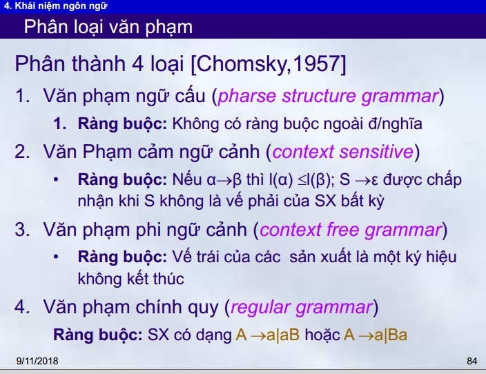
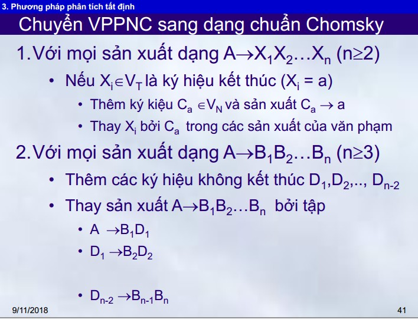

# Phân tích cú pháp

## 1. Văn phạm

* Định nghĩa: Văn phạm gồm 4 thành phần:
	* T (terminal): tập kí hiệu kết thúc
	* N (non terminal): tập kí hiệu không kết thúc
	* S (start): kí hiệu bắt đầu
	* R (rule): tập luật sản xuất

* Mục đích
	* Quy định cú pháp của ngôn ngữ mà văn phạm sản sinh
	* Cho 1 xâu bất kì, sử dụng thuật toán và văn phạm, ta sẽ xác định được xâu đầu vào có thuộc ngôn ngữ mà văn phạm sản sinh hay không? Nói cách khác, ta kiểm tra được xâu đầu vào có đúng cú pháp hay không?

* Phân loại văn phạm

	* VP phi ngữ cảnh có vế trái chỉ là 1 kí hiệu không kết thúc, nghĩa là không quan tâm ngữ cảnh (các kí hiệu xung quanh) trong câu là gì.

* VP phi ngữ cảnh thuộc dạng chuẩn Chomsky nếu mọi sản xuất có dạng A -> BC hoặc A -> a

* Mọi VP phi ngữ cảnh không chứa epsilon sản xuất để có thể chuyển về dạng chuẩn Chomsky

* 2 phương pháp chính để phân tích cú pháp
	* CYK
		* Điều kiện áp dụng: VPPNC ở dạng chuẩn Chomsky
	* Earley

# ...