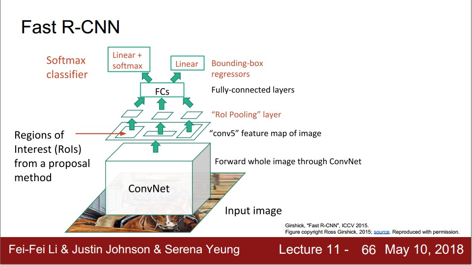
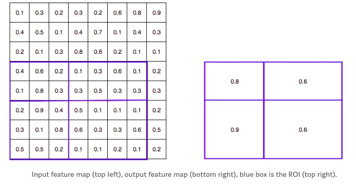
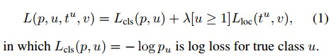
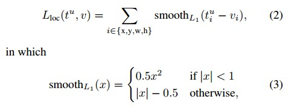

Fast RCNN
===============

* Mô hình tương tự RCNN, nhưng có sự cải tiến giúp thời gian train, predict giảm và độ chính xác tăng

* Nhẫn xét
	* Toàn bộ ảnh được truyền qua ConvNet. Các ROI sẽ được trích từ feature map chứ không phải trích tự input image như RCNN. Do đó tính toán ở tầng ConvNet không còn dư thừa.
		* ROI vẫn được xác định từ input image bởi Selective Search
	* Lớp ROI pooling giúp đưa các ROI về một kích thước cố định để phù hợp với đầu vào của Fully connected
	
	
	
	* Sau khi qua FC thì tách thành 2 nhánh
		* Nhánh 1: Dùng softmax với K+1 đầu ra thể hiện xác suất của mỗi class. Hàm loss là log loss
		* Nhánh 2: Fully connected với 4*K đầu ra tương ứng với bounding box của K class. Hàm loss là L1 smooth loss

* Sự khác biệt quan trọng so với RCNN
	* Training end-to-end trong 1 pha sử dụng multi-task loss (classification loss và localization loss)
	
	
	
	* Loại bỏ dư thừa trong tính toán ở ConvNet

* Nhược điểm
	* Thời gian predict lâu do thời gian thực hiện Selective Search cho việc region proposal