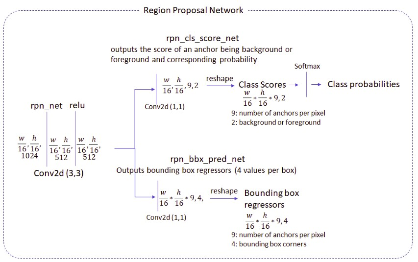

Faster RCNN
====================

* Mô hình dựa trên Fast RCNN nhưng có sự cải tiến là phần Region Proposal Network không sử dụng Selective Search mà xây dựng mạng CNN để tự học. Nhờ vậy mà thời gian predict giảm

* Training thì có thể kết hợp đồng thời train Region Proposal Network (RPN) hoặc train tuần tự (như tác giả thực nghiệm) RPN và Detection Network. Khi train phần mạng này thì cố định phần mạng kia, sau đó đóng băng phần shared conv layer.

* Mạng RPN
	* Input là conv feature map (kết quả của input image đi qua shared conv network (head), đây là mạng pretrained imagenet)
	* Sinh ra các anchor box (như nhau đối với mọi ảnh) dải đều trên input image với các scale, ratio khác nhau. Các anchor box có thể coi như các ước lượng thô ban đầu của các region proposal. Mục đích của mạng RPN là học cách tìm ra các box có tiềm năng cao là chứa đối tượng và học hàm chuyển đổi tọa độ các anchor box về tọa độ mới khớp với đối tượng tốt hơn.
	* Với mỗi anchor box có nhãn thuộc 3 nhãn sau: positive, negative, other. Khi training RPN thì mạng sẽ học cách nhận biết anchor box nào chứa đối tượng và khi chứa đối tượng thì hàm loss sẽ quan tâm đến việc tính lỗi cho sự sai lệch về bounding box coefficient
	

* **Tài liệu tham khảo phân tích chi tiết mô hình và quá trình train - predict và có code**

# References
* [Object Detection and Classification using R-CNNs](http://www.telesens.co/2018/03/11/object-detection-and-classification-using-r-cnns/)