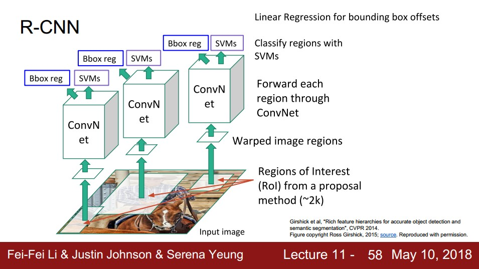
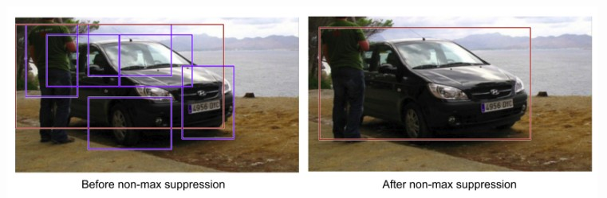

R-CNN
===========

* Kiến trúc mô hình

	* Input: 1 bức ảnh
	* Thuật toán Selective Search sẽ tìm ra ~2000 Regions of Interest (ROI) ảnh con có khả năng cao chứa object => Selective Search giúp lọc ra các vùng có khả năng cao chứa object, khắc phục hạn chế nếu dùng slide window phải duyệt nhiều vị trí, kích thước
	* Với mỗi ROI, biến đổi về kích thước ảnh cố định phù hợp với mạng CNN (AlexNet)
	* Truyền mỗi warped ROI qua mạng CNN gồm 5 conv layer để trích ra vector đặc trưng của lớp pool5
		* Xác định label: đưa qua 2 fully connected layer, thu được vector 4096 chiều. Dùng binary linear SVM để tính score theo từng class. Với mỗi ảnh input ta thu được các ROI và score theo từng class. Xét từng class, dùng thuật toán tham lam Non-Maximum Suppression để chọn ra các ROI có score cao (và không quá nhiều)
		
		* Xác định vị trí bounding box: Với mỗi ROI và vector pool5 tương ứng và với mỗi class ta sẽ tính ra bounding box bằng một số hàm chuyển đổi. Các tham số được train để giảm thiểu lỗi localization
		
* Training gồm 3 giai đoạn
	* Fine tuning CNN pretrained. Nhiệm vụ là phân loại đúng các ROI vào N+1 class (+1 là background)
		* Mỗi ROI có IOU >= 0.5 với ground truth box được coi là positive example
		* Vì fine tuning nên để learning rate thấp = 0.001
		* Mỗi batch size 128 gồm 32 postive example và 96 negative example
	* Train linear SVM theo từng class
		* Sử dụng ngưỡng IOU >= 0.3 là positive example
	* Train bounding box regressor
		* Sử dụng cặp proposal / truth bounding box mà IOU >= 0.6 để training.

* Predict
	* Dùng Selective Search để tìm ra ~ 2000 ROI
	* Truyền qua các layer để tính ra score SVM theo từng class cho từng ROI và tính bounding box
	* Dùng thuật toán non-maximum suppression để loại bỏ các ROI overlap với ROI có score cao hơn

* Nhược điểm của R-CNN
	* Dùng Selective Search lâu
	* Tính feature cho các ROI một cách độc lập gây tốn thời gian (bởi vì có rất nhiều phần overlap giữa các ROI, bị tính toán lặp lại khi qua CNN)