Gradient Descent
=========================

# Mục lục

# 1. Tổng quan
* Dùng để tìm nghiệm để tối ưu hóa 1 hàm số
* Kịch bản: cần tối thiểu hóa hàm J(theta) với theta là tham số của model, ta sẽ cập nhật theta theo hướng **ngược** với hướng đạo hàm của hàm J theo theta.

# 2. Các biến thể của Gradient descent (GD variants)
* Có 3 biến thể của GD, được xác định dựa theo *lượng* dữ liệu dùng để tính gradient của hàm mục tiêu
* Tùy vào lượng dữ liệu dùng nhiều hay ít, ta sẽ có trade-off
	* Dùng nhiều dữ liệu trong 1 lần update: tham số được update chính xác hơn, nhưng tốn thời gian thực hiện update
	* Dùng ít dữ liệu trong 1 lần update: tham số được update kém chính xác hơn, nhưng giảm được thời gian thực hiện update (trong TH này, hàm mục tiêu sẽ tăng - giảm đột ngột, biến động hơn)
* Ẩn dụ: Khi cần hỏi 1 nhóm người (dữ liệu) về hướng đường cần tìm (hỏi hướng đạo hàm) để đến đích (tối ưu hóa obj fnc)
	* Nếu mỗi lần đến 1 vùng, ta phải hỏi đủ 1 nhóm người thì ta thường tìm được hướng đi tốt hơn, nhưng tốn thời gian hỏi
	* Nếu mỗi lần đến 1 vùng, ta chỉ hỏi 1 vài người thì độ chính xác của kết quả thường biến động nhiều (lúc tốt, lúc xấu), nhưng giảm được thời gian hỏi đường

## 2.1. Batch Gradient Descent
* Sử dụng toàn bộ data để tính đạo hàm của hàm cost theo parameter để dùng cho **một lần** cập nhật parameter
* Ưu điểm:
	* Ổn định (Hàm cost giảm ồn định) trong quá trình tối ưu
* Nhược điểm:
	* Cập nhật chậm do phải dùng nhiều dữ liệu trong mỗi lần cập nhật
	* Không phù hợp khi data lớn (không đẩy vào ram cùng lúc được)
	* Không dùng cho bài toán online (các điểm dữ liệu đến theo stream)
* Batch gradient descent đảm bảo hội tụ tới global minimum với hàm cost là convex và đảm bảo hội tụ tới local minimum với hàm cost là non-convex

## 2.2. Stochastic Gradient Descent
* Mỗi lần cập nhật parameter chỉ sử dụng 1 instance để tính đạo hàm
* Ưu điểm:
	* Cập nhật nhanh trong 1 lần cập nhật, thường với số lần cập nhật ít đã hội tụ (nhanh hơn so với Batch GD)
	* Phù hợp trong bài toán online
	* Có tiềm năng di chuyển đến local minimum tốt hơn
* Nhược điểm:
	* Không ổn định (hàm cost giảm không ổn định, biến thiên mạnh) trong quá trình tối ưu
* Khi giảm learning rate thích hợp sẽ giúp cho SGD hội tụ như Batch GD

## 2.3. Mini Batch Gradient Descent
* Mỗi lần cập nhật parameter sử dụng 1 mini batch (1 lượng instance nhỏ) để tính đạo hàm
* Biến thể này thường được dùng phổ biến hơn SGD và BGD do có sự *cân bằng* giữa 2 biến thể BGD và SGD (cân bằng được ưu - nhược điểm của 2 biến thể này)
* Ưu điểm:
	* Giúp ổn định hơn so với SGD trong quá trình tối ưu

## 2.4. Các thách thức khi dùng Mini batch GD
* Nếu chỉ dùng mini batch GD đơn thuần thì ta gặp phải nhiều vấn đề sau
	* Chọn learning rate phù hợp là 1 vấn đề khó
		* Nếu learning rate nhỏ thì quá trình hội tụ sẽ chậm, mất nhiều thời gian training
		* Nếu learning rate lớn thì quá trình di chuyển tham số sẽ nhanh hơn, đi được đến vùng đất xa hơn. Nhưng vấn đề là khó đạt được đến local (global) minimum do *sải chân quá rộng*, khó chui vào local minimum. Thậm chí trong nhiều TH, quá trình tối ưu có thể phân kì, hàm cost tăng chứ không giảm
	* Lập lịch learning rate theo cách truyền thống là không phù hợp
		* Ví dụ dùng phương pháp tôi ủ (annealing) để giảm learning rate theo lịch định trước, nhưng lịch trình này phải định trước, do đó không thể đạt hiệu quả tốt trên mọi tập dataset
	* Hiện tại dùng learning rate như nhau trong việc cập nhật mọi tham số (trong vecto tham số có nhiều tham số)
		* Việc này chưa tốt bởi vì mỗi tham số có phạm vi khác nhau (cùng là di chuyển 1 bước nhưng với tham số 1 thì sự thay đổi này tạo ra ảnh hưởng vừa đủ, nhưng với tham số 2 thì sự thay đổi này tạo ra ảnh hưởng quá lớn)
	* Một vấn đề khác là trong mạng neural thì thường gặp phải hàm cost là non-convex và có nhiều điểm local minimum và saddle point (điểm yên ngựa)
		* Độ khó nằm ở saddle point, SGD khó thoát ra khỏi được điểm yên ngựa bởi vì tại đây, đạo hàm gần như bằng 0 theo mọi hướng => Không có phương hướng đi đâu về đâu !!!

# 3. Các thuật toán Gradient Descent
## 3.1. Các thuật toán không tự cập nhật learning rate

### 3.1.1. Momentum
* Giải quyết được 1 vài vấn đề của SGD
	* Hội tụ nhanh hơn (và giảm sự dao động hỗn độn ngược chiều liên tục) khi di chuyển trong vùng mà 1 chiều dốc hơn chiều khác
* Công thức cập nhật tham số theta

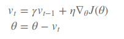
	* Gamma thường có giá trị là 0.5, 0.9, 0.99. Mặc định nên chọn gamma = 0.9

* Momentum giúp tăng tốc theo dimension mà gradient cùng hướng với hướng của chiều đó trong quá khứ và giảm tốc theo dimension mà gradient ngược hướng với hướng của chiều đó trong quá khứ (nghĩa là nếu gradient chỉ cho hướng cùng với hướng trong quá khứ thì nhờ quán tính ta sẽ di chuyển một bước dài hơn, điều này giúp hội tụ nhanh hơn và ngược lại nếu gradient chỉ cho hướng ngược với hướng trong quá khứ thì ta sẽ làm giảm sự đổi hướng đột ngột này để tránh dao động mạnh)

### 3.1.2. Nesterov accelerated gradient
* Công thức cập nhật tham số theta

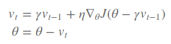

* Thuật toán NAG khá giống với Momentum, nhưng khác ở *vị trí tính đạo hàm*
	* Momentum tính đạo hàm tại vị trí theta hiện tại
	* NAG tính đạo hàm tại vị trí tương lai (được ước lượng thô theo momentum quá khứ)
* NAG thường đạt hiệu quả tốt hơn Momentum
	* Giải thích trực quan: NAG tích hợp quan sát trong tương lại, còn Momentum chỉ dựa trên quá khứ và hiện tại. Khi con người di chuyển, ta thường phải quan sát vị trí tương lai (mà ta ước lượng sẽ đạt đến nếu cứ tuân theo quán tính hiện tại); tại vị trí tương lai này, nếu có chướng ngại vật thì ta sẽ điều chỉnh hướng ngay ở điểm hiện tại (NAG) chứ không *mù quáng* lao theo quán tính (như Momentum)

## 3.2. Các thuật toán tự cập nhật learning rate

### 3.2.1. Adagrad
* Thuật toán này có đặc điểm
	* Áp dụng learning rate khác nhau cho các tham số khác nhau
	* Tự điều chỉnh learning rate
		* *Tăng* learning rate (tương đối) đối với những tham số mà đạo hàm trong quá khứ là lớn
		* *Giảm* learning rate (tương đối) đối với những tham số mà đạo hàm trong quá khứ là nhỏ
	* **Nhược điểm lớn**
		* Sự tăng (giảm) learning rate chỉ mang tính tương đối. Theo thời gian thì learning rate của từng tham số luôn giảm. Nhưng giảm nhiều hay ít là phụ thuộc vào độ lớn của đạo hàm theo tham số đó trong quá khứ
		* Theo thời gian thì learning rate sẽ tiến về 0, khi đó model không học tiếp được
* Công thức cập nhật tham số theta
	* Xét từng tham số
	
	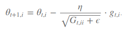
	* Dạng vectorized
	
	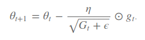
	* Giải thích
		* Phần mẫu (chứa căn bậc 2) tạo ra sự khác biệt giữa Adagrad và SGD. Phần này giúp làm giảm learning rate theo từng tham số (giảm nhiều hay ít phụ thuộc vào ma trận G)
		* Ma trận Gt là ma trận đường chéo, trong đó phần tử gii là tổng của các bình phương grad theo tham số theta i từ vòng lặp iter 0 -> t. Nếu đạo hàm trong quá khứ lớn thì tổng tích lũy này sẽ lớn và learning rate áp dụng cho tham số này sẽ giảm nhiều

### 3.2.2. Adadelta
* Thuật toán này khắc phục được hạn chế của Adagrad (learning rate luôn giảm sau các vòng lặp)
* Ý tưởng
	* Đạo hàm trong quá khứ có giá trị lớn thì learning rate giảm
	* Bình phương đạo hàm ở vòng lặp t không cộng trực tiếp vào phần đạo hàm quá khứ (Adagrad) mà tổ hợp có trọng số. Đây là điểm mấu chốt, khắc phục được nhược điểm của Adagrad
* Công thức cập nhật tham số theta

	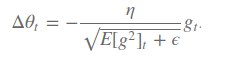
	hay
	
	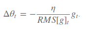
	trong đó
	
	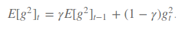

* Trong các công thức cập nhật theta đã gặp thì delta theta không có cùng đơn vị với theta. Để khắc phục điều này, ta có biến thể khác của Adadelta

	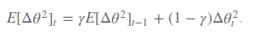
	
	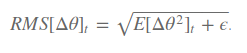
	
	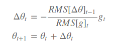

* Với biến thể này thì ta không cần learning rate default !

# 3.2.3. RMSProb
* Thuật toán này được phát minh bởi Geoff Hinton, giống với thuật toán Adadelta (công thức đầu)
* RMSProb và Adadelta được phát triển độc lập nhằm giải quyết vấn đề của Adagrad (learning rate luôn giảm theo thời gian)
* Công thức cập nhật tham số theta

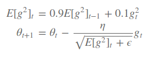
	* Hinton đề xuất tham số mặc định: gamma = 0.9, learning rate = 0.001

# 4. Lựa chọn thuật toán Gradient Descent phù hợp

# Tổng kết
* Demo trực quan so sánh các thuật toán Gradient descent
	* Biểu diễn các đường đồng mức và tiến trình hoạt động của các thuật toán
	
		* Momentum và NAG hơi bị *quá đà*, nhưng NAG nhờ quan sát tương lai nên không bị *quá đà* nhiều như Momentum
		* SGD hội tụ chậm nhất
	* Thực nghiệm tại vùng có saddle point
	
		* SGD bị tắc ở saddle point
		* Các thuật toán Adaptive Learning rate tìm ra hướng đi tốt nhanh hơn các thuật toán Momentum, NAG
		* NAG tìm ra hướng đi tốt trước Momentum

# Tài liệu tham khảo
* [An overview of gradient descent optimization algorithms](http://ruder.io/optimizing-gradient-descent/)