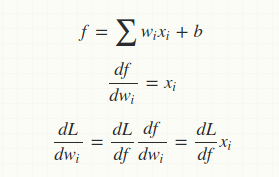

Tổng hợp câu hỏi
====================

* Activation
	* - [x] Tại sao output của activation không zero centered lại là vấn đề
		* Nhược điểm lớn của sigmoid activation là đạo hàm gần bằng 0 khi |x| lớn. Ngoài ra, output của sigmoid thuộc (0,1), khi forward sang layer sau thì input nhận được là x > 0. Theo công thức đạo hàm khi backward
		
		ta thấy nếu x > 0 thì dw luôn > 0 hoặc < 0. Khi training thì w di chuyển dễ bị *zig zac* (nghĩa là lúc thì tăng w, lúc thì giảm w, không có sự mượt). Nhưng đây không phải nhược điểm quá lớn như vấn đề vanishing gradient
* Optimization
	* - [x] Giải thích contour dạng dẹt (trong minh họa sự zig zac của SGD)
		* Hãy tưởng tượng bạn đang ở trong vùng đồi núi, đang đi tìm vùng đồng bằng (tìm minimum trong optimization). Bạn được phép di chuyển theo 2 chiều tọa độ (vector w có 2 chiều). Giả sử nếu đi theo phương x thì chỉ di chuyển 1 bước ngắn là đã thay đổi được độ cao (núi rất dốc, đạo hàm lớn), nhưng nếu đi theo phương y thì phải di chuyển 1 bước dài mới giảm được độ cao. 
		* Khi đó để nhanh chóng tìm được đồng bằng (hội tụ nhanh) thì cần tập trung hướng theo phương y (tăng độ dài bước theo phương y, giảm độ dài bước theo phương x).
		* Nếu theo phương x ta đang đứng ở chân núi, nghĩa là dù tiến hay lùi theo phương x một bước ngắn cũng khiến tăng độ cao thì khi đó xuất hiện hiện tượng zic zag trong quá trình thực hiện của SGD. Bởi vì **nhược điểm ở đây là learning rate bằng nhau theo mọi chiều**, trong khi ở ví dụ trên ta cần thay đổi tỉ lệ step size giữa 2 chiều để hội tụ nhanh hơn
		* Momentum giải quyết nhược điểm này của SGD. Momentum chính là exponential average decaying của các gradient trong quá khứ. Các grad càng gần thời gian hiện tại sẽ đóng góp 1 trọng số lớn hơn cho hướng đi tiếp theo.
			* Giải thích momentum theo ý nghĩa vật lý: nếu di chuyển theo hướng gần với hướng trong quá khứ thì vận tốc tăng lên, giúp di chuyển nhanh hơn, nếu di chuyển theo hướng ngược với hướng trong quá khứ thì vận tốc sẽ giảm (và hướng đi cũng bị ảnh hưởng bởi quán tính) => Giúp hội tụ nhanh hơn, tránh dao động quá mạnh như SGD
	* - [] Second order vs First order method trong optimization
	* - [] Ma trận Hessian và Condition number trong Second order method
	* - [] Exponential average decaying trong các thuật toán Adam, RMSprop
