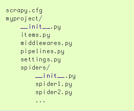

Scrapy
================

# Tổng quan

# Command line tool
* Các câu lệnh thực hiện trên terminal (bắt đầu bằng **scrapy**) để thao tác với project hoặc thao tác không cần gắn liền với 1 project cụ thể
* Một số câu lệnh
	* Không yêu cầu project
		* ``startproject``
		* ``genspider``
		* ``settings``
		* ``runspider``
		* ``shell``
		* ...
	* Yêu cầu project
		* ``crawl``
		* ``check``
		* ``parse``
		* ``list``
		* ...
* Cấu trúc thư mục mặc định của 1 project scrapy

* Scrapy tìm kiếm tham số cấu hình trong file scrapy.cfg, vị trí ưu tiên tìm kiếm theo thứ tự là
	* Trong thư mục gốc project
	* Trong thư mục user: ``~/.config/scrapy.cfg`` và ``~/.scrapy.cfg``
	* Trong thư mục hệ thống: ``/etc/scrapy.cfg`` hoặc ``c:\scrapy\scrapy.cfg``
* [Command Line Tool - Scrapy Document](https://doc.scrapy.org/en/latest/topics/commands.html) 

# Spider
* Định nghĩa
* Chu trình cơ bản mà Spider định nghĩa
* Class Spider
	* Mọi spider khác (kể cả user định nghĩa) cần kế thừa spider này
	* Các thuộc tính: name, start_urls, allowed_domains,...
	* Các phương thức:
		* ``start_requests()``
		* ``parse()``
		* ...
* Class CrawlSpider
	* Hỗ trợ crawl mọi link (recursive) của websites
	* Các thuộc tính:
		* rules: là 1 list các đối tượng Rule. Mỗi đối tượng Rule quy định cách thức crawl trên các websites (link như nào thì extract và cách lấy ra thông tin từ các link đó như thê nào,...)
		* Cách định nghĩa 1 đối tượng Rule
			* link_extractor: định nghĩa 1 link ntn thì sẽ được extract
			* callback: hàm quy định cách thức xử lý mỗi link được extract từ link_extractor
			* follow: biến boolean quyết định liệu mỗi link tìm thấy được từ link_extractor có được crawl tiếp trên link đó không
			* process_links: hàm dùng để lọc các link được extract từ link_extractor (tham số của hàm là đối tượng thuộc kiểu Link)
			* process_requests: hàm dùng để lọc các request tạo ra từ link_extractor
			> Luồng thực hiện (không thấy trong doc nói rõ): các link thõa mãn link_extractor được trích ra, sau đó qua hàm process_links để lọc, sau đó tạo các request, với mỗi req sẽ đi qua hàm process_request để lọc tiếp, sau đó engine sẽ gửi req và khi nhận về response thì sẽ gọi callback để xử lý
			* ...
* Class XMLFeedSpider
	* Dùng để trích ra những node có tên xác định từ 1 tài liệu xml và lấy thông tin từ các nodes đó
	* Các thuộc tính
		* iterator: Định nghĩa kiểu iterator dùng để tìm kiếm các node trong tài liệu. Nên dùng 'iternodes' vì hiệu năng tốt
		* itertag: tên node cần tìm
		* namespace:
	* Các phương thức
		* adapt_response():
		* parse_node(res, node): cần phải override hàm này. Hàm này được gọi với mỗi node tìm được, cần trích ra thông tin, return Item hoặc Request
		* process_results():
* Class CSVFeedSpider
* Class SitemapSpider